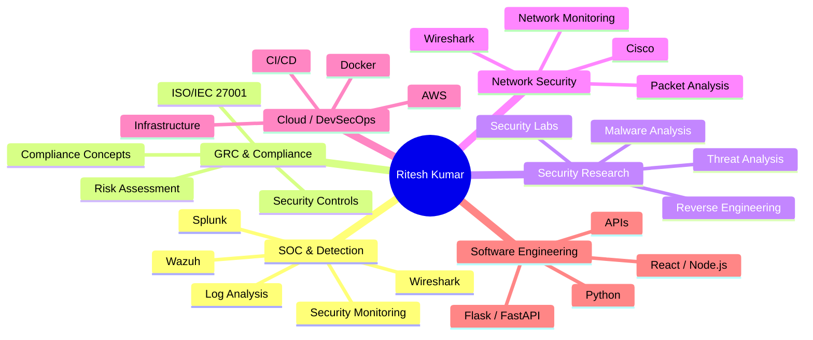
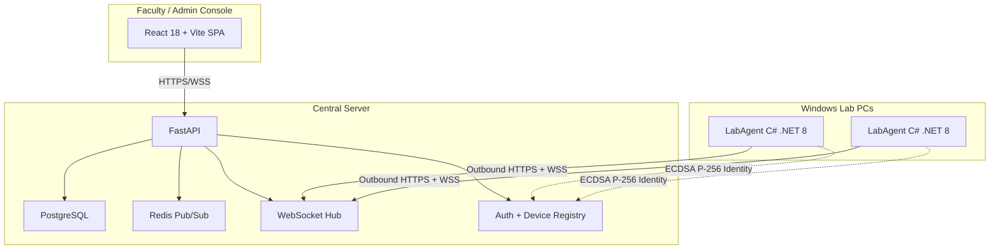
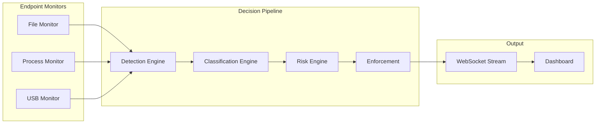

<!-- ============================================================
     RITESH KUMAR — GitHub Profile README
     Repository: Riteshkumar1205/Riteshkumar1205
     
     CONTENT MODEL:
     • Lines between DYNAMIC-METRICS markers are auto-generated
     • Everything else is human-maintained
     • See docs/automation.md for details
     ============================================================ -->

<div align="center">

# Ritesh Kumar

**Cybersecurity & Security Engineering**  
Building security systems, detection workflows, and backend platforms with an engineering-first approach to monitoring, prevention, automation, and compliance.

<br>

[](https://github.com/Riteshkumar1205)
[](https://linkedin.com/in/ritesh-kumar-k78590)
[](mailto:riteshhare@gmail.com)
[](https://exploit-haven-desk.lovable.app)

</div>

---

## ⚡ Recruiter Quick View

```text
┌──────────────────────────────────────────────────────────────┐
│ SECURITY ENGINEERING                                         │
│ SOC • Detection • Endpoint Security • Network Security       │
│                                                              │
│ GOVERNANCE                                                   │
│ ISO/IEC 27001 • Risk • Controls • Compliance                 │
│                                                              │
│ ENGINEERING                                                  │
│ Python • Backend • APIs • Docker • AWS • CI/CD               │
│                                                              │
│ EVIDENCE                                                     │
│ Projects • Labs • Internships • Certifications               │
│                                                              │
│ CURRENT FOCUS                                                │
│ Detection Engineering • Security Research • GRC              │
└──────────────────────────────────────────────────────────────┘
```

---

## 🧭 360° Security & Engineering View



---

## 🧾 Proof of Work

This profile is evidence-driven. Here is how my capabilities translate into tangible experience:

<details>
<summary><b>SOC & Detection</b></summary>

- **Tools**: Splunk, Wazuh, Wireshark, Windows Event Viewer
- **Projects**: **DLP Intelligence Platform**
- **Experience**: Cybersecurity Internship (Cisco Networking Academy)
- **Labs**: Detection engineering configurations, endpoint alert generation
</details>

<details>
<summary><b>GRC & Compliance</b></summary>

- **Standards**: ISO/IEC 27001, GDPR, DPDPA
- **Projects**: Project-based risk scoring engines
- **Work**: Compliance documentation and gap analysis frameworks
</details>

<details>
<summary><b>Security Engineering</b></summary>

- **Projects**: **LabAgent**, **SecureQR-COE**, **Endpoint Activity Monitor**
- **Implementation**: Cryptographic Device Identity, Policy Enforcement, Real-time event pipelines.
</details>

<details>
<summary><b>Network Security</b></summary>

- **Tools**: Cisco Packet Tracer, Wireshark
- **Projects**: **WiFiScanner-Sniffer**
- **Experience**: Cisco Networking Academy internship (VLANs, static routing, ACLs)
</details>

<details>
<summary><b>Software Engineering</b></summary>

- **Stack**: Python, C#, FastAPI, Docker, WebSockets
- **Projects**: Backend APIs for **LabAgent**, Full-stack implementation for **SecureQR-COE**
</details>

---

## 🚀 Flagship Projects

### 1. Enterprise DLP Intelligence Platform
**Focus:** Data Loss Prevention & Security Monitoring
**Problem:** Need for a centralized system to monitor endpoint exfiltration attempts across multiple vectors.
**Architecture:** Real-time event pipelines analyzing File, Process, USB, and Clipboard integrity.
**Security Relevance:** Direct application of SOC monitoring, endpoint telemetry, and detection engineering.
**Tech Stack:** Python, WebSockets, Detection Engines.
**Implementation:** Developed local monitors that stream events to a centralized risk engine.
**Repository:** [data-loss-prevention-system](https://github.com/Riteshkumar1205/data-loss-prevention-system)

### 2. LabAgent Endpoint Manager
**Focus:** Security Engineering & Identity
**Problem:** Insecure management of lab endpoints and unauthorized access.
**Architecture:** Outbound WSS connections enforcing ECDSA P-256 identities.
**Security Relevance:** Applied cryptographic identity, DPAPI key protection, and secure communications.
**Tech Stack:** C# .NET 8, FastAPI, PostgreSQL, Redis.
**Implementation:** Built the Windows agent and central management server.
**Repository:** [LabAgent](https://github.com/Riteshkumar1205/LabAgent)

---

## 🏗️ Architecture & Systems Showcase

<details>
<summary><b>View Architecture: LabAgent (Endpoint Management)</b></summary>


</details>

<details>
<summary><b>View Architecture: Enterprise DLP Intelligence</b></summary>


</details>

---

## ⚙️ Security Engineering Story

```text
MONITOR    →   Endpoint logs, network traffic, system events
   ↓
DETECT     →   Identify anomalous behavior via heuristics
   ↓
ANALYZE    →   Correlate alerts against known IOCs
   ↓
DECIDE     →   Calculate risk scores and compliance gaps
   ↓
ENFORCE    →   Trigger automated policies
   ↓
LOG        →   Maintain immutable audit trails
   ↓
IMPROVE    →   Refine detection rules based on incident data
```

---

## 🛠️ Technology Matrix

| Security | Languages | Backend | Frontend | Cloud / DevOps | Data / Infra |
| :--- | :--- | :--- | :--- | :--- | :--- |
| Splunk | Python | FastAPI | React | AWS | PostgreSQL |
| Wazuh | JavaScript | Flask | Vite | Docker | MySQL |
| Wireshark | TypeScript | Node.js | Tailwind | GitHub Actions | SQLite |
| Burp Suite | C/C++ | Express | | Linux | REST APIs |
| Nmap | Bash | | | | WebSockets |

*(Note: Matrix represents working knowledge and project-based experience)*

---

## 📊 Live Metrics Dashboard

<!-- DYNAMIC-METRICS:START — Auto-generated metrics from platform APIs -->
> **GitHub:** 33 public repositories · 5 followers · 6 total stars
> **LeetCode:** 457 problems solved (Easy: 154 · Medium: 231 · Hard: 72)
>
> *Automatically updated · Last refresh: 2026-10-07 12:55 UTC*
<!-- DYNAMIC-METRICS:END -->

<div align="center">
  
  
</div>

---

## 🔄 Recently Updated

<!-- DYNAMIC-RECENT:START -->
- **[Profile](https://github.com/Riteshkumar1205/Profile)** — *Updated: October 07, 2026*
- **[dsa-practice-2025](https://github.com/Riteshkumar1205/dsa-practice-2025)** — *Updated: October 06, 2026*
- **[SecureQR-COE](https://github.com/Riteshkumar1205/SecureQR-COE)** — *Updated: September 03, 2026*
- **[LabAgent](https://github.com/Riteshkumar1205/LabAgent)** — *Updated: August 31, 2026*
<!-- DYNAMIC-RECENT:END -->

---

## 💼 Experience

**Cybersecurity Internship**  
*Cisco Networking Academy (x AICTE)*  
**Domain:** Network Security & SOC Foundations  
**Responsibilities:** Hands-on configuration of VLANs, static routing, and Access Control Lists. Practical packet analysis and network monitoring.

**Software & Security Internship**  
*InternPro*  
**Domain:** Software Engineering & Automation  
**Responsibilities:** Developing backend scripts and automation tooling using Python.

---

## 🏆 Certifications

- **Cybersecurity Essentials & Foundations** — Cisco Networking Academy
- **Networking Basics** — Cisco Networking Academy
- **Cybersecurity Fundamentals** — Palo Alto Networks
- **AWS Cloud Foundations** — AWS Academy
- **SOC Analyst (Blue Team)** — Blue Cape Security
- **Red Hat System Administration** — Red Hat

*(Credential IDs and verification URLs available upon request.)*

---

## 🎓 Education

**B.Tech in Computer Science & Artificial Intelligence**  
G. L. Bajaj Institute of Technology & Management, Greater Noida

---

## Connect & Collaborate

<div align="center">

**Interested in security engineering, detection engineering, GRC, or secure systems? Connect with me.**

[](https://github.com/Riteshkumar1205?tab=repositories)
[](https://linkedin.com/in/ritesh-kumar-k78590)
[](https://exploit-haven-desk.lovable.app)
[](mailto:riteshhare@gmail.com)

</div>

---

<div align="center">
<sub>Building security-focused systems — one commit at a time.</sub>
</div>
